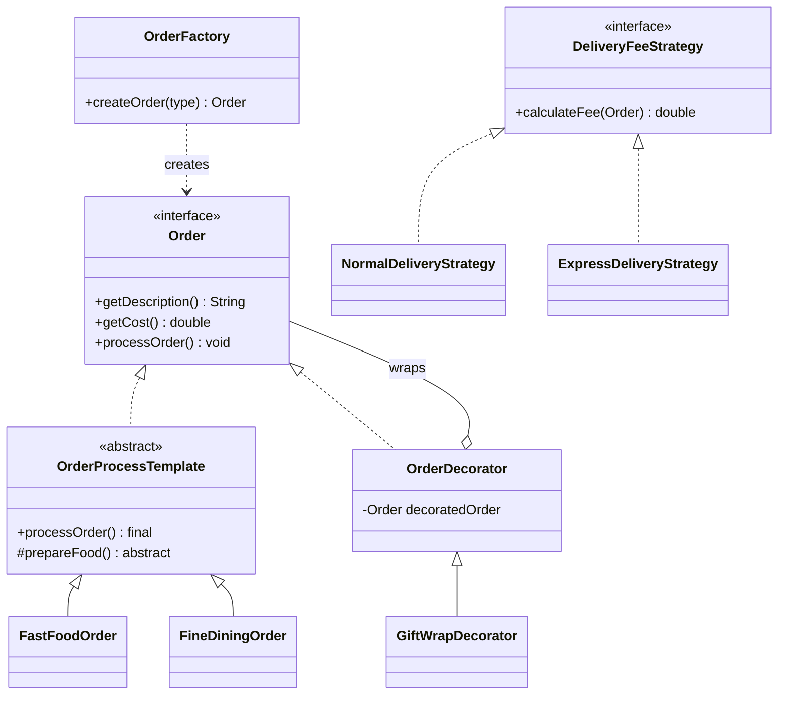

# Online Food Delivery Order Processing System - Architecture & Design Patterns

## Overview
This project implements a console-based **Online Food Delivery Order Processing System** using Java. The architecture focuses on modularity, extensibility, and strict adherence to **SOLID principles**. Four key design patterns are employed to handle object creation, workflow definition, fee calculation, and dynamic feature addition.

## Package Structure
The system is modularized into packages based on functionality and design patterns:

- **`com.delivery.decorator`**: Contains the core `Order` interface and the **Decorator Pattern** implementation for order add-ons.
- **`com.delivery.factory`**: Contains the **Factory Pattern** implementation for creating order instances.
- **`com.delivery.strategy`**: Contains the **Strategy Pattern** implementation for delivery fee algorithms.
- **`com.delivery.template`**: Contains the **Template Method Pattern** implementation for the order processing workflow.
- **`com.delivery`**: Root package containing the `Main` entry point.

---

## Design Patterns Implementation

### 1. Factory Pattern (Order Creation)
**Goal**: Decouple the client code from the specific classes of orders being created.

- **Implementation**:
    - **`OrderFactory`** (`com.delivery.factory`): A static factory class.
    - **Usage**: The client calls `OrderFactory.createOrder("fastfood")` instead of `new FastFoodOrder()`.
- **Benefit**: Adheres to the **Open/Closed Principle** (partially) and **Dependency Inversion**. New order types can be added without changing the client code, only the factory needs updating.

### 2. Template Method Pattern (Order Processing)
**Goal**: Define the skeleton of an algorithm in a method, deferring some steps to subclasses.

- **Implementation**:
    - **`OrderProcessTemplate`** (`com.delivery.template`): An abstract class that implements the `Order` interface.
    - **`processOrder()`**: A `final` method that defines the fixed workflow:
        1. `validateOrder()` (Concrete)
        2. `prepareFood()` (**Abstract** - implemented by subclasses)
        3. `packageOrder()` (Concrete)
        4. `dispatchOrder()` (Concrete)
    - **Concrete Classes**: `FastFoodOrder`, `FineDiningOrder`, `CloudKitchenOrder` implement the specific `prepareFood()` logic (e.g., "Assembling burger" vs. "Cooking steak").
- **Benefit**: Ensures a consistent processing lifecycle while allowing specific steps to vary. Prevents code duplication for common steps like validation and dispatching.

### 3. Strategy Pattern (Delivery Fee Calculation)
**Goal**: Define a family of algorithms, encapsulate each one, and make them interchangeable.

- **Implementation**:
    - **`DeliveryFeeStrategy`** (`com.delivery.strategy`): An interface defining `calculateFee(Order order)`.
    - **Concrete Strategies**:
        - `NormalDeliveryStrategy`: Flat fee.
        - `ExpressDeliveryStrategy`: Higher base fee + percentage of order cost.
        - `SurgeDeliveryStrategy`: Highest base fee + higher percentage.
    - **Usage**: The strategy is passed into the calculation method at runtime (`main` method example).
- **Benefit**: Eliminates complex `if-else` or `switch` statements for fee calculation. New strategies can be added easily without modifying existing code.

### 4. Decorator Pattern (Order Add-ons)
**Goal**: Attach additional responsibilities to an object dynamically.

- **Implementation**:
    - **`Order` Interface** (`com.delivery.decorator`): Defines the contract (`getDescription()`, `getCost()`).
    - **`OrderDecorator`**: An abstract class implementing `Order` that holds a reference to a wrapped `Order` object.
    - **Concrete Decorators**: `GiftWrapDecorator`, `PriorityHandlingDecorator`, `ExtraPackagingDecorator`.
    - **Logic**: Each decorator calls the wrapped order's method and adds its own behavior/cost (e.g., `super.getCost() + 5.0`).
- **Benefit**: Allows dynamic stacking of features (e.g., an order can be both "Gift Wrapped" and have "Priority Handling") without creating an explosion of subclasses like `GiftWrappedFastFoodOrder`.

---

## Architecture Diagram (Conceptual)



## How to Run

1. **Compile**:
   ```bash
   javac -d bin -sourcepath src src/com/delivery/Main.java
   ```

2. **Run**:
   ```bash
   java -cp bin com.delivery.Main
   ```
